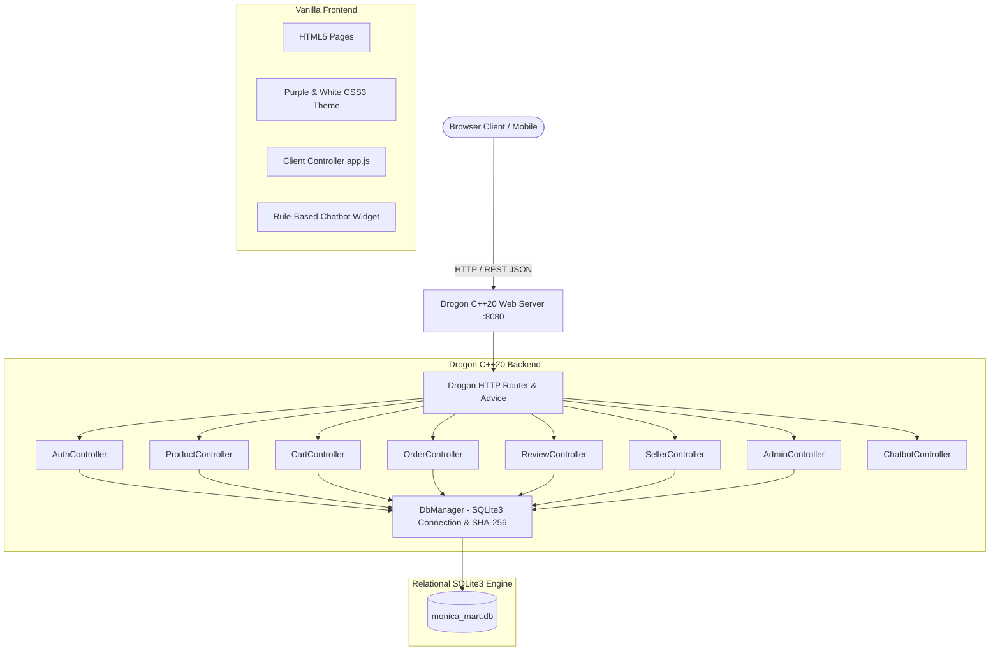
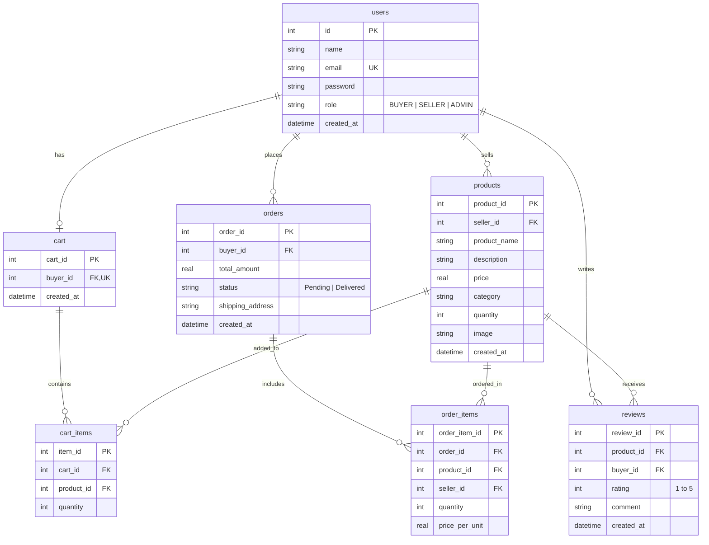

# 🛍️ MONICA MART — Multi-Seller E-Commerce Platform

**Individual College Capstone Project**  
**Developer / Student Name:** Monica Sornam  
**Target Submission:** Capstone Prototype (~80% Functional Working System)  
**Backend:** C++20 & Drogon Web Framework  
**Database:** SQLite3  
**Build System:** CMake  
**Frontend:** HTML5, CSS3, JavaScript (Vanilla — No React/Vue/Angular)  
**Deployment:** Docker-ready (Multi-stage build) & GitHub-ready  

---

## 📌 1. Project Overview & Objective

**MONICA MART** is a robust, full-featured multi-seller e-commerce web platform engineered using modern **C++20** and the asynchronous **Drogon Framework**. It demonstrates the end-to-end commerce lifecycle connecting three distinct user roles:

1. **BUYER**: Discovers products via text search and category filtering, inspects real-time inventory, manages a shopping cart with quantity limits, completes checkout, tracks order history, and submits star ratings and feedback.
2. **SELLER**: Registers as a merchant, accesses a private Seller Dashboard with sales metrics, lists new products with live preview, updates inventory pricing/quantities, safely deletes products, and monitors customer purchase orders.
3. **ADMIN**: Exercises platform-wide governance via an Admin Dashboard, auditing registered users, inspecting all system orders and platform gross revenue, and removing inappropriate products from the marketplace.
4. **AI SHOPPING ASSISTANT**: A built-in rule-based AI chatbot floating widget providing instant help with registration, inventory queries, checkout procedures, and order tracking without external paid APIs.

---

## 🏗️ 2. System Architecture



---

## 👥 3. User Roles & Security Matrix

| Feature / Action | Guest | Buyer | Seller | Admin |
| :--- | :---: | :---: | :---: | :---: |
| Browse & Search Catalog | ✅ | ✅ | ✅ | ✅ |
| Category Filter & Reviews | ✅ | ✅ | ✅ | ✅ |
| Interactive AI Assistant | ✅ | ✅ | ✅ | ✅ |
| Add to Cart & Checkout | ❌ | ✅ | ❌ | ❌ |
| Order History | ❌ | ✅ | ❌ | ❌ |
| Submit Product Review | ❌ | ✅ | ❌ | ❌ |
| Add / Edit Own Products | ❌ | ❌ | ✅ | ❌ |
| View Seller Sales Orders | ❌ | ❌ | ✅ | ❌ |
| View All Registered Users | ❌ | ❌ | ❌ | ✅ |
| View All Platform Orders | ❌ | ❌ | ❌ | ✅ |
| Remove Inappropriate Items| ❌ | ❌ | ❌ | ✅ |

### Security Implementations:
- **Password Hashing:** Passwords are cryptographically hashed using SHA-256 before storage; raw passwords are never stored or exposed in API responses.
- **Role-Based Access Control (RBAC):** Every controller verifies role privileges (`isBuyer()`, `isSeller()`, `isAdmin()`) via session state and auth headers.
- **Resource Ownership Verification:** A Seller can only modify or delete their own inventory. Seller A cannot tamper with Seller B's listings.
- **Stock Integrity:** Quantity boundary checks prevent overselling and disallow adding more items to the cart than currently in warehouse stock.
- **Duplicate Review Prevention:** A `UNIQUE(product_id, buyer_id)` constraint ensures one review per buyer per product.

---

## 🗄️ 4. Database Schema (SQLite)

The relational schema is defined in `database/database.sql`:



---

## 🔑 5. Predefined Demo Accounts (For Viva / Evaluation)

For quick demonstration and testing during project evaluation, click the **"Quick Demo"** buttons on the Login page or use these credentials:

| Role | Email | Password | Purpose |
| :--- | :--- | :--- | :--- |
| **Admin** | `admin@monicamart.com` | `Admin@123` | Inspect users, all orders, platform moderation |
| **Seller 1** | `tech_seller@monicamart.com` | `Password@123` | TechZone store owner (Laptops, Phones, Watches) |
| **Seller 2** | `fashion_seller@monicamart.com` | `Password@123` | Elite Fashion store owner (Handbags, Shoes) |
| **Buyer 1** | `buyer1@monicamart.com` | `Password@123` | Student buyer account with order history |
| **Buyer 2** | `buyer2@monicamart.com` | `Password@123` | Alternate buyer account |

---

## 📁 6. Project Structure

```
MonicaMart/
│
├── backend/
│   ├── controllers/
│   │   ├── AuthController.h / AuthController.cc       # User registration, login, logout, getMe
│   │   ├── ProductController.h / ProductController.cc # Catalog listing, search, create, update, delete
│   │   ├── CartController.h / CartController.cc       # Cart management & stock limit enforcement
│   │   ├── OrderController.h / OrderController.cc     # Checkout transaction, order history
│   │   ├── ReviewController.h / ReviewController.cc   # Product ratings (1-5 stars) & comments
│   │   ├── SellerController.h / SellerController.cc   # Seller inventory & sales orders
│   │   ├── AdminController.h / AdminController.cc     # User audits, catalog moderation, revenue
│   │   └── ChatbotController.h / ChatbotController.cc # Rule-based AI shopping assistant
│   ├── filters/
│   │   └── AuthHelper.h                               # Session & role verification helper
│   ├── models/
│   │   ├── DbManager.h / DbManager.cc                 # Thread-safe SQLite queries & SHA-256
│   ├── config.json                                    # Drogon server listener & static file config
│   └── main.cc                                        # Server entry point & DB initialization
│
├── frontend/
│   ├── index.html                                     # Homepage with hero & featured items
│   ├── products.html                                  # Marketplace catalog with search & category filter
│   ├── product-details.html                           # Full specifications & review submission
│   ├── cart.html                                      # Shopping cart with quantity controls
│   ├── checkout.html                                  # Order confirmation & address review
│   ├── orders.html                                    # Buyer past orders & delivery status
│   ├── login.html                                     # Login with 1-click Demo Fill buttons
│   ├── register.html                                  # Registration with Buyer / Seller selector
│   ├── seller-dashboard.html                          # Seller portal with inventory & incoming orders
│   ├── add-product.html                               # Add product form with live card preview
│   ├── edit-product.html                              # Edit product with ownership guard
│   ├── admin-dashboard.html                           # Admin portal with user audit & moderation
│   ├── css/
│   │   └── style.css                                  # Responsive Purple & White stylesheet
│   └── js/
│       └── app.js                                     # State management, cart badge, API & chatbot
│
├── database/
│   └── database.sql                                   # SQLite DDL schema & comprehensive seed data
│
├── scripts/
│   ├── test_suite.py                                  # 22-step automated verification test runner
│   └── dev_server.py                                  # Local development server with full SQLite REST API
│
├── CMakeLists.txt                                     # C++20 CMake build configuration
├── Dockerfile                                         # Multi-stage production container build
├── .dockerignore
├── .gitignore
└── README.md
```

---

## 🚀 7. How to Build and Run

### Option A: 1-Command Docker Deployment (Recommended)

To run the full C++ Drogon backend in an isolated container on any system with Docker installed:

```bash
# 1. Build the Docker image
docker build -t monicamart .

# 2. Run the container
docker run -d -p 8080:8080 --name monicamart-app monicamart
```

Open your browser and navigate to:  
👉 **`http://localhost:8080`**

---

### Option B: Local Native C++20 & Drogon Build (Linux / macOS / WSL)

#### Prerequisites:
- Modern C++ compiler supporting C++20 (`g++ >= 11` or `clang++ >= 13`)
- CMake `>= 3.16`
- SQLite3 development libraries (`libsqlite3-dev`)
- JsonCpp (`libjsoncpp-dev`)
- Drogon Framework (`libdrogon-dev` or built from source)

#### Step-by-Step Compilation:
```bash
# 1. Create build directory
mkdir build && cd build

# 2. Configure with CMake
cmake -DCMAKE_BUILD_TYPE=Release ..

# 3. Compile the executable
make -j$(nproc)

# 4. Run the Drogon server
./MonicaMart
```

Access the application in your browser:  
👉 **`http://localhost:8080`**

---

### Option C: Instant Local Development Server (Windows / Python)

If running on Windows without a C++20 Drogon compiler pre-configured, use the provided local server:

```powershell
python scripts/dev_server.py
```

This launches the server on `http://localhost:8080` backed by the exact SQLite database and serving the complete frontend.

---

## 🧪 8. Automated Testing & Verification Checklist

The test suite in `scripts/test_suite.py` validates all **22 required business logic and evaluation checks**:

```bash
python scripts/test_suite.py
```

### Verified Test Cases (100% Pass Rate):
- [x] **Test 1:** Buyer registration (`newbuyer@test.com`)
- [x] **Test 2:** Seller registration (`newseller@test.com`)
- [x] **Test 3:** Admin login (`admin@monicamart.com` / `Admin@123`)
- [x] **Test 4:** Buyer login (`buyer1@monicamart.com` / `Password@123`)
- [x] **Test 5:** Seller login (`tech_seller@monicamart.com` / `Password@123`)
- [x] **Test 6:** Invalid password rejection
- [x] **Test 7:** Duplicate email registration prevention (`IntegrityError`)
- [x] **Test 8:** Seller product creation (`Wireless Bluetooth Earbuds`)
- [x] **Test 9:** View seller's own inventory
- [x] **Test 10:** Seller edit own product price and name
- [x] **Test 11:** Safe product deletion by owner
- [x] **Test 12:** Buyer marketplace catalog loading (8+ sample items)
- [x] **Test 13:** Keyword search by product name ("watch")
- [x] **Test 14:** Category filtering ("Electronics")
- [x] **Test 15:** Add product to shopping cart
- [x] **Test 16:** Stock boundary check (prevent purchasing > available stock)
- [x] **Test 17:** Order checkout confirmation, stock decrement & cart wipe
- [x] **Test 18:** Buyer order history display
- [x] **Test 19:** Seller sales order visibility
- [x] **Test 20:** Product review submission & duplicate review restriction
- [x] **Test 21:** Admin moderation (Remove inappropriate item)
- [x] **Test 22:** Rule-based AI shopping assistant query response

---

## 🌐 9. REST API Reference

### Authentication
- `POST /api/register` — Register a new Buyer or Seller
- `POST /api/login` — Authenticate credentials and establish session
- `POST /api/logout` — Terminate session
- `GET /api/me` — Inspect current session user

### Products & Catalog
- `GET /api/products` — List products (query params: `search`, `category`)
- `GET /api/products/{id}` — Get product details and verified reviews
- `POST /api/products` — Create a product (*Seller only*)
- `PUT /api/products/{id}` — Update a product (*Owner Seller only*)
- `DELETE /api/products/{id}` — Delete a product (*Owner Seller or Admin*)

### Shopping Cart & Checkout
- `GET /api/cart` — Get buyer cart items and calculated totals (*Buyer only*)
- `POST /api/cart` — Add product to cart with stock validation (*Buyer only*)
- `PUT /api/cart/{id}` — Update cart quantity (*Buyer only*)
- `DELETE /api/cart/{id}` — Remove item from cart (*Buyer only*)
- `POST /api/orders` — Checkout cart items and confirm order (*Buyer only*)
- `GET /api/orders` — View buyer order history (*Buyer only*)
- `GET /api/orders/{id}` — View order breakdown (*Buyer or Admin*)

### Reviews
- `POST /api/reviews` — Submit 1-5 star rating and comment (*Buyer only*)
- `GET /api/products/{id}/reviews` — View product reviews

### Seller & Admin
- `GET /api/seller/products` — Get inventory belonging to current seller
- `GET /api/seller/orders` — Get orders containing items from this seller
- `GET /api/admin/users` — List registered users (*Admin only*)
- `GET /api/admin/products` — List all products (*Admin only*)
- `GET /api/admin/orders` — List all system orders (*Admin only*)
- `GET /api/admin/stats` — Platform summary metrics (*Admin only*)
- `DELETE /api/admin/products/{id}` — Remove inappropriate item (*Admin only*)

### AI Assistant
- `POST /api/chatbot` — Rule-based shopping help (Input: `{"message": "..."}`)

---

## ☁️ 10. Deployment Guide (Cloud)

The repository includes a production-ready `Dockerfile` and can be deployed directly to cloud services:

### Deploy to Render / Fly.io:
1. Push repository to GitHub.
2. Link repository to [Render.com](https://render.com) or [Fly.io](https://fly.io).
3. Select **Docker** environment runtime.
4. Set port to `8080`.
5. The container will automatically compile Drogon and run the server.

---

## 🎓 11. Viva / Evaluation Walkthrough Guide

When demonstrating the Capstone Project to your professor or examiner, follow this 5-minute flow:

1. **Buyer Flow:**
   - Open `index.html`. Explain the purple-and-white theme and responsive design.
   - Go to `products.html`, type `"watch"` to demonstrate real-time search.
   - Click category filter `"Electronics"`.
   - Open `"Ultra Slim Laptop Pro 15"`, review the ratings.
   - Log in using the **Buyer** quick-fill button.
   - Add the laptop to the cart, navigate to `cart.html`, adjust quantity (+ / -).
   - Click **Proceed to Checkout**, enter address, click **Confirm Order**.
   - Show the resulting order in `orders.html`.

2. **Seller Flow:**
   - Log in as **Seller** (`tech_seller@monicamart.com`).
   - Show the **Seller Dashboard**: active products, units sold, total revenue.
   - Click **+ Add Product**, demonstrate the **Live Card Preview**, fill in details, and publish.
   - Switch to the **Orders** tab to show customer orders for this seller's products.

3. **Admin Flow:**
   - Log in as **Admin** (`admin@monicamart.com`).
   - Open **Admin Dashboard**: show platform-wide users, all products, and total platform revenue.
   - Demonstrate the **Remove Inappropriate Product** feature with confirmation dialog.

4. **AI Assistant Demo:**
   - Click the floating purple chat bubble in the bottom right corner.
   - Click chips or type *"How can I add a product?"* or *"How can I checkout?"* to demonstrate instant answers.

5. **Code & Architecture:**
   - Highlight the C++20 Drogon controllers (`AuthController`, `ProductController`, etc.).
   - Explain `DbManager` SQLite parameterized queries preventing SQL injection.
   - Show the 22/22 passing automated test results (`python scripts/test_suite.py`).

---

## 🌟 12. Future Enhancements

- Integration with payment gateways (Razorpay / Stripe) for live monetary transactions.
- Seller sales analytics charts using Chart.js.
- Real-time customer delivery tracking using WebSockets.
- Email invoice dispatch via SMTP.

---

&copy; 2026 **Monica Sornam** — Individual College Capstone Project. All rights reserved.
