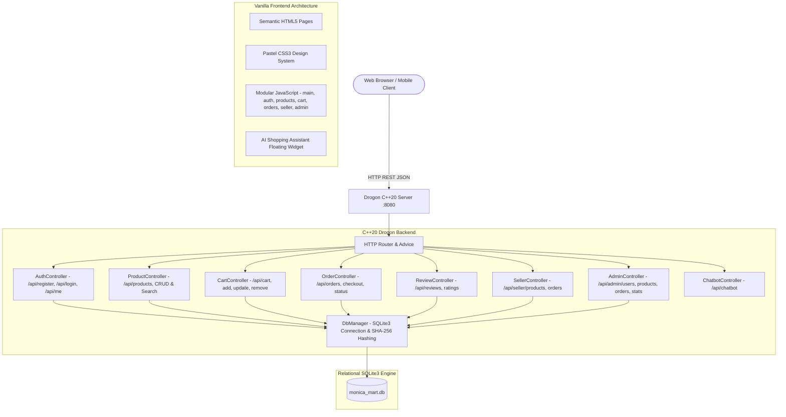

# 🌸 MONICA MART — Multi-Seller E-Commerce Platform

**Individual College Capstone Project**  
**Developer / Student Name:** Monica Sornam  
**Project Name:** Monica Mart  
**Project Type:** Multi-Seller E-Commerce Website  
**Backend:** C++20 & Drogon Web Framework  
**Database:** SQLite3 / PostgreSQL  
**Build System:** CMake & Docker  
**Frontend:** Semantic HTML5, Modern CSS3 (Strict Pastel Theme), Vanilla JavaScript (No React/Angular/Vue/Node)  

---

## 📌 1. Project Overview & Objective

**MONICA MART** is a complete, fully functional multi-seller e-commerce web platform engineered using modern **C++20** and the asynchronous **Drogon Framework**. Designed and built by **Monica Sornam** as an individual college capstone project, it reflects the architectural lifecycle of an online marketplace (similar to Amazon / Flipkart), tailored to a clean and robust academic scope.

### Core User Roles:
1. **BUYER:**
   - Registers and logs in securely.
   - Searches products by name (case-insensitive) and filters by category.
   - Views detailed product specifications, stock quantities, and customer feedback.
   - Manages items in a real-time shopping cart with warehouse stock limits.
   - Completes simplified checkout (Order Placement &rarr; Confirm Order &rarr; Order Successful).
   - Generates unique Order IDs (`#MM-XXXX`).
   - Tracks order status (`Pending`, `Confirmed`, `Shipped`, `Delivered`, `Cancelled`).
   - Submits 1-to-5 star ratings and reviews (with duplicate prevention).
2. **SELLER:**
   - Registers as an independent vendor and logs in.
   - Accesses an exclusive **Seller Dashboard** with live metrics (Total Products, Total Orders, Total Revenue).
   - Manages inventory: Adds new products, edits listings, updates prices/stock, and deletes items.
   - Views purchase orders containing their items and updates order fulfillment statuses.
3. **ADMIN:**
   - Platform governance dashboard.
   - Audits all registered user accounts and roles.
   - Reviews all orders across the entire marketplace.
   - Moderates product listings: safely removes inappropriate products with safety confirmation dialogs.
4. **AI SHOPPING ASSISTANT (Compulsory Capstone Feature):**
   - Built-in floating chat widget embedded in the website interface.
   - Responds to shopping questions (searching, adding to cart, checking out, tracking orders, categories, reviews, seller registration) using an intelligent intent/keyword engine.

---

## 🎨 2. Final Website Colour Palette

The website follows an elegant, soft pastel design identity across all pages:

| Colour Name | Hex Code | Visual Role & Usage in Monica Mart |
| :--- | :--- | :--- |
| **Lavender** | `#AE9CB7` | **Primary Brand Colour**: Header accents, navigation brand highlight, active states, section headings, borders, dashboard badges. |
| **Dusty Rose** | `#D6B0BF` | **Secondary Accents**: Secondary buttons, product card accents, navigation hover states, badges, form input focus. |
| **Soft Pink** | `#F4C4C3` | **Backgrounds & Soft UI**: Section backgrounds, card highlights, customer review cards, badge backgrounds. |
| **Peach** | `#FBD8C6` | **Accents & Empty States**: Hero section accents, call-to-action sections, footer accents, empty-state areas. |
| **Clean White** | `#FFFFFF` | **Card Surfaces**: High-contrast card interiors for maximum readability. |
| **Charcoal Slate** | `#3C3140` | **Accessible Typography**: High WCAG AA contrast for text, keeping content crisp and readable for examiners. |

---

## 🏗️ 3. System Architecture



---

## 📁 4. Project Directory Structure

```
MonicaMart/
│
├── CMakeLists.txt              # C++20 build configuration (Drogon, SQLite3, Threads)
├── Dockerfile                  # Multi-stage Ubuntu build & minimal runtime
├── README.md                   # Full documentation & viva guide
├── .gitignore
│
├── config/
│   └── config.json             # Drogon server configuration (port, session, doc root)
│
├── sql/
│   ├── schema.sql              # Relational database table definitions (DDL)
│   └── seed.sql                # Predefined admin, sellers, buyers, products, categories
│
├── src/                        # C++20 source code
│   ├── main.cc                 # Entry point, DB init, CORS middleware
│   ├── models/
│   │   ├── DbManager.h
│   │   └── DbManager.cc        # SQLite3 thread-safe singleton & SHA-256
│   ├── filters/
│   │   └── AuthHelper.h        # Session & role-based authorization
│   └── controllers/
│       ├── AuthController.h / .cc
│       ├── ProductController.h / .cc
│       ├── CartController.h / .cc
│       ├── OrderController.h / .cc
│       ├── ReviewController.h / .cc
│       ├── SellerController.h / .cc
│       ├── AdminController.h / .cc
│       └── ChatbotController.h / .cc
│
├── public/                     # Frontend web application (Served to browser)
│   ├── index.html              # Home page ("Shop Smart. Shop Beautiful.")
│   ├── login.html              # Authentication with 1-click demo accounts
│   ├── register.html           # Buyer and Seller registration
│   ├── products.html           # Catalog with search & category filtering
│   ├── product.html            # Product details, stock limits & reviews
│   ├── cart.html               # Shopping cart with quantity increment/decrement
│   ├── checkout.html           # College checkout flow with unique Order ID
│   ├── orders.html             # Buyer order history with status tracking
│   ├── seller.html             # Seller dashboard, product CRUD & seller orders
│   ├── admin.html              # Admin dashboard, user audit & moderation
│   │
│   ├── css/
│   │   └── style.css           # Strict Pastel Palette styling
│   │
│   └── js/
│       ├── main.js             # Shared state, dynamic navbar by role, toasts
│       ├── auth.js             # Login, register, logout & role redirection
│       ├── products.js         # Search, category filter, catalog & details
│       ├── cart.js             # Cart management, quantity updates, subtotals
│       ├── orders.js           # Order placement, confirmation, history
│       ├── seller.js           # Seller inventory CRUD & sales orders
│       ├── admin.js            # User audit, product moderation & analytics
│       └── chatbot.js          # AI Shopping Assistant floating widget
│
├── docs/
│   └── viva_guide.md           # College capstone viva preparation & code explanation
│
└── scripts/
    ├── dev_server.py           # Zero-setup local server executing SQLite REST API
    └── test_suite.py           # Automated test suite covering all 22+ business rules
```

---

## 👥 5. User Roles & Security Matrix

| Feature / Permission | Guest | Buyer | Seller | Admin |
| :--- | :---: | :---: | :---: | :---: |
| Browse & Search Catalog | ✅ | ✅ | ✅ | ✅ |
| Category Filter & Reviews View | ✅ | ✅ | ✅ | ✅ |
| Interactive AI Assistant | ✅ | ✅ | ✅ | ✅ |
| Add to Cart & Update Quantity | ❌ | ✅ | ❌ | ❌ |
| Checkout & Order Placement | ❌ | ✅ | ❌ | ❌ |
| View Personal Order History | ❌ | ✅ | ❌ | ❌ |
| Submit Star Rating & Review | ❌ | ✅ | ❌ | ❌ |
| Access Seller Dashboard | ❌ | ❌ | ✅ | ❌ |
| Add / Edit / Delete Own Products | ❌ | ❌ | ✅ | ❌ |
| View Seller Sales Orders & Status | ❌ | ❌ | ✅ | ❌ |
| Access Admin Dashboard | ❌ | ❌ | ❌ | ✅ |
| Audit All Registered Users | ❌ | ❌ | ❌ | ✅ |
| View All Marketplace Orders | ❌ | ❌ | ❌ | ✅ |
| Remove Inappropriate Products | ❌ | ❌ | ❌ | ✅ |

---

## 🚀 6. How to Run the Application

### Option A: Zero-Setup Local Dev Runner (Windows / macOS / Linux)
No C++ toolchain or Docker installation required. Executes the exact same SQLite database and REST API endpoints:
```bash
# 1. Start the server
python scripts/dev_server.py

# 2. Open in your web browser:
http://localhost:8080
```

### Option B: C++20 Drogon Native Build (CMake)
Requires Drogon and SQLite3 installed:
```bash
mkdir build
cd build
cmake ..
cmake --build .
./MonicaMart
```

### Option C: Docker Multi-Stage Container
```bash
docker build -t monica-mart .
docker run -p 8080:8080 monica-mart
```

### Option D: Run Automated Test Suite
Validates all 22 capstone business rules directly against the SQLite database:
```bash
python scripts/test_suite.py
```

---

## 🔑 7. Pre-Configured Test Credentials

| Role | Email | Password | Access / Purpose |
| :--- | :--- | :--- | :--- |
| **Admin** | `admin@monicamart.com` | `Admin@123` | Platform Governance, Product Moderation, User Audit |
| **Seller** | `tech_seller@monicamart.com` | `Password@123` | Electronics Storefront, Inventory CRUD, Order Tracking |
| **Seller** | `fashion_seller@monicamart.com` | `Password@123` | Fashion & Boutique Storefront |
| **Buyer** | `buyer1@monicamart.com` | `Password@123` | Shopping Cart, Checkout, Order History, Star Reviews |
| **Buyer** | `buyer2@monicamart.com` | `Password@123` | Secondary Buyer Account |

*(Tip: On the `login.html` page, click any of the 1-click demo buttons to automatically populate these credentials!)*

---

## 📦 8. Sample Products

| Product Name | Category | Price | Stock | Description |
| :--- | :--- | :---: | :---: | :--- |
| **Laptop Pro 15 Slim** | Electronics | ₹45,000 | 12 | High performance Intel Core i7 processor with 16GB RAM and 512GB SSD. |
| **Mobile Neo 5G Smartphone** | Electronics | ₹18,000 | 25 | Flagship 5G smartphone with 64MP AI triple camera and AMOLED display. |
| **Headphones Wireless Bluetooth** | Electronics | ₹999 | 40 | Over-ear Bluetooth headphones with active noise cancellation and 30h battery. |
| **Smart Watch Active 2** | Accessories | ₹1,999 | 30 | Waterproof fitness smartwatch with heart rate and sleep tracking. |
| **Handbag Designer Vegan Leather** | Fashion | ₹1,499 | 18 | Handcrafted pastel vegan leather handbag with golden zippers. |
| **Performance Running Shoes** | Fashion | ₹2,499 | 22 | Lightweight athletic shoes with shock-absorbing foam sole. |
| **Organic Herbal Skincare Kit** | Beauty | ₹899 | 35 | All-natural facial cleanser, toner, and vitamin C glow serum. |
| **Minimalist LED Desk Lamp** | Home | ₹649 | 50 | Touch-controlled dimmable eye-caring desk lamp with 3 color modes. |

---

## 🌐 9. REST API Reference

### Authentication
- `POST /api/register` — Register Buyer or Seller (`name`, `email`, `password`, `role`)
- `POST /api/login` — Authenticate and start session (`email`, `password`)
- `POST /api/logout` — End user session
- `GET /api/me` — Inspect current session user

### Product Catalog & Search
- `GET /api/products` — Retrieve all products (Supports `?search=` and `?category=`)
- `GET /api/products/{id}` — Retrieve product details with customer reviews
- `POST /api/products` — Add product (Seller only)
- `PUT /api/products/{id}` — Update product (Seller only)
- `DELETE /api/products/{id}` — Delete product (Seller or Admin)

### Shopping Cart
- `GET /api/cart` — View buyer's current shopping cart
- `POST /api/cart` or `POST /api/cart/add` — Add product to cart with quantity
- `PUT /api/cart/{id}` or `PUT /api/cart/update/{id}` — Update cart item quantity
- `DELETE /api/cart/{id}` or `DELETE /api/cart/remove/{id}` — Remove item from cart

### Orders & Checkout
- `POST /api/orders` — Checkout cart items, validate stock, clear cart, generate Order ID
- `GET /api/orders` — View buyer's order history
- `GET /api/orders/{id}` — View order details
- `PUT /api/orders/{id}/status` — Update order status (Seller or Admin)

### Reviews & Ratings
- `POST /api/reviews` — Submit 1-5 star rating and comment (Buyer only)
- `GET /api/products/{id}/reviews` — List all reviews for a product

### Seller Management
- `GET /api/seller/products` — Retrieve products listed by logged-in seller
- `GET /api/seller/orders` — Retrieve purchase orders containing seller's items

### Administrator Moderation
- `GET /api/admin/stats` — Total users, products, orders, and gross platform revenue
- `GET /api/admin/users` — List all registered user accounts
- `GET /api/admin/products` — List all products with seller associations
- `GET /api/admin/orders` — List all orders across the entire platform
- `DELETE /api/admin/products/{id}` — Remove inappropriate listing

### AI Shopping Assistant
- `POST /api/chatbot` — Smart intent and keyword query assistant (`message`)

---

## 🎓 10. Developer Credit
**Monica Sornam**  
Individual College Capstone Project &bull; 2026
